# AI Multi-Cloud Kubernetes Platform (Google Kubernetes Engine (GKE) + Azure Kubernetes Service (AKS)) 

An AI-assisted, multi-cloud Kubernetes reliability demonstration that carries one controlled availability incident from detection through an evidence-grounded Claude diagnosis, a deterministic policy gate, human approval, a cross-cloud traffic shift, recovery verification, and a Git-based rollback.

**Stack:** Google GKE · Azure AKS · Terraform · Argo CD · Istio · Prometheus · Alertmanager · OpenTelemetry · Tempo · Grafana · Anthropic Claude API · GitHub Actions · Bash · Make

[](https://github.com/tejas-ae/AI-Multi-Cloud-K8s/actions/workflows/terraform-ci.yml)
[](https://github.com/tejas-ae/AI-Multi-Cloud-K8s/actions/workflows/gitops-ci.yml)
[](LICENSE)

This is a portfolio MVP, not a production system. I built it to show that an LLM can sit inside a real reliability workflow without ever being trusted to act on its own.

## Architecture

Terraform provisions two independent, hardened clusters and fronts them with Azure Traffic Manager. Each cluster runs its own Argo CD, its own Istio mesh, and its own observability stack. There is no shared control plane and no cross-cluster service discovery.

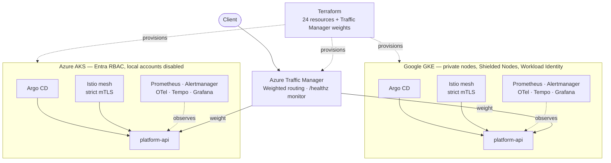

The incident lifecycle is a one-way pipeline where every durable change is gated. Claude produces a structured **recommendation** — never a shell command, patch, or executable action. A deterministic validator then either rejects it or hands a bounded proposal to me for approval.

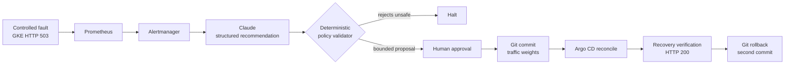

## Demonstrated result

I ran bounded GKE availability incident from detection through rollback. The numbers below are read from the captured screenshots in [the incident walkthrough](docs/incident-walkthrough.md); they are evidence of a live run, not values you can reproduce by running code.

| Stage | Result |
| --- | --- |
| Controlled fault | GKE application route returned HTTP 503 while `/healthz` stayed healthy |
| Prometheus signal | Source-side HTTP 503 rate reached ~8.91 requests/second |
| Alert | `PlatformApiAvailabilityDemo` fired and reached Alertmanager |
| Claude analysis | Live structured response passed policy at **0.85** confidence |
| Recommendation | Shift Traffic Manager from GKE 50 / AKS 50 to GKE 30 / AKS 70 |
| Approval boundary | The analyzer only proposed; I reviewed and committed the Git change |
| Recovery | Traffic Manager returned HTTP 200 five times; both endpoints stayed Online |
| Rollback | A second reviewed Git commit restored GKE 50 / AKS 50 (**demonstrated**, not automated) |

**Reproducible vs. evidenced.** What you can reproduce from this repo is the *offline policy path*: a recorded fixture at **0.91** confidence that the validator accepts, plus an adversarial fixture it rejects — both run with no cloud credentials and no API key. The live-run figures in the table above (0.85 confidence, ~8.91 req/s) come only from the screenshots and are not reproducible from code. The 0.91 offline fixture and the 0.85 live run are two separate recorded examples.

## What I built

Every capability below maps to code in the source repository.

**Infrastructure (Terraform).** Modules for GKE, AKS, isolated VPC/VNet networking, managed identities, static ingress addresses, and an Azure Traffic Manager profile using weighted routing with a `/healthz` health monitor. Providers are pinned with `~>` constraints and a committed lock file. The plan is held to **exactly 24 resources** by `review-terraform-plan.sh`, which renders the plan to JSON and asserts an exact create allowlist — computing both unexpected and missing creates — alongside specific security fields (GKE private nodes and a single authorized network; AKS local accounts disabled, Run Command disabled, Entra RBAC, one authorized IP range; node-pool ceilings).

**Cluster hardening.** GKE uses private nodes, Shielded Nodes with secure boot and integrity monitoring, Workload Identity, and an IP-restricted API via master authorized networks. AKS disables local accounts and Run Command, uses Entra (Azure AD) RBAC, and restricts the API server to authorized IP ranges.

**Delivery (GitOps).** An independent Argo CD per cluster. In-cluster delivery is restricted to a namespace-scoped Role bound to the Argo CD application controller, rather than cluster-admin.

**Service mesh.** A separate Istio mesh per cluster with strict workload mTLS (a `PeerAuthentication` in `STRICT` mode) and a redundant ingress gateway — two replicas with host anti-affinity and a pod disruption budget.

**Observability (per cluster).** Prometheus + Alertmanager, an OpenTelemetry Collector, Tempo, and Grafana, all configured through Helm values in Git. Metrics discovery is a Git-managed `PodMonitor`; tracing is wired through an Istio `Telemetry` resource into the collector; SLO recording and multi-window burn-rate alerting live in a `PrometheusRule`; Alertmanager routing is declared in the same Helm values.

**Reliability experiment.** A controlled, GKE-only HTTP 503 fault injected through the Istio `VirtualService` (`fault.sh`). It is gated by an exact confirmation value and targets only the application route, leaving the health route intact.

**AI + policy.** `ai_copilot/claude.py` calls the Anthropic Messages API, sends only a sanitized incident bundle, requires structured JSON output, and auto-discovers the model — dependency-free, standard library only. `ai_copilot/incident.py` is a deterministic, dependency-free validator that treats the model output as untrusted. It enforces schema v1; incident/diagnosis ID match; an alert allowlist; correlated evidence (metric, trace, and Kubernetes all present); evidence freshness (≤ 900s); a confidence floor (≥ 0.80); an action allowlist (only `shift_traffic`); source/destination validity; a weight delta of 1–20; mandatory human approval; destination health and minimum replica capacity; rollback weights that match current Git state; and it recomputes the proposed weights with a 1–99 bounds check before emitting a Git diff for the traffic-weights file.

**CI and safety.** Two GitHub Actions workflows. `terraform-ci` runs a format check, `init`, `validate`, ShellCheck, and the repository-safety guard. `gitops-ci` renders every kustomization and asserts safety invariants — `maxSurge: 0` on the workload, the four SLO/demo alert rules by name, the `istio-ingress` gateway, OpenTelemetry tracing wiring, and Tempo usage reporting disabled — then templates the Helm charts at pinned versions, runs ShellCheck, and executes the offline incident-policy replay including the adversarial reject-unsafe fixture. `verify-repository.sh` blocks committing state, plans, kubeconfigs, private keys, and private evidence, and greps for API-key and private-key patterns.

## Safety boundaries

The analyzer cannot patch Kubernetes, call Terraform, merge Git, or change any cloud resource. Its entire output is a JSON recommendation that the deterministic validator must accept, and even an accepted proposal only becomes a Git diff that a human commits.

- **Confirmation-gated actions.** Fault injection requires `CONFIRM_FAULT_INJECTION=AI-Multi-Cloud-K8s`; `terraform apply` and `destroy` require `CONFIRM_APPLY` / `CONFIRM_DESTROY` set to the same value.
- **Untrusted model output.** The validator rejects anything outside its allowlists — the committed adversarial fixture (a `delete_cluster` action at 0.99 confidence with approval disabled) is rejected, and that rejection runs in CI.
- **Repository hygiene.** Credentials stay in an ignored `.env`; Terraform state lives in a versioned GCS backend; raw plans stay local; and `verify-repository.sh` runs in both CI workflows to keep secrets and state out of the repo.

## Reproduce the policy decision locally

The offline policy path needs no cloud credentials and no API key:

```bash
make incident-replay        # validator accepts the recorded 0.91-confidence fixture (JSON result)
make incident-proposal      # same fixture rendered as the Git diff it would produce
make incident-reject-unsafe # adversarial fixture is rejected; exits non-zero as expected
```

The live Claude path is optional and keeps the key only in the current shell — it is never written to disk:

```zsh
read -s "ANTHROPIC_API_KEY?Paste Anthropic API key (hidden): "
echo
export ANTHROPIC_API_KEY
make incident-claude
unset ANTHROPIC_API_KEY
```

`incident-claude` sends only the sanitized incident bundle to the Messages API, then pipes the structured response straight into the same deterministic validator.

## Cost and teardown

The billable footprint is two node pools (GKE `e2-standard-4` ×2, AKS `Standard_D4s_v3` ×2) plus Traffic Manager, Cloud NAT, load balancers, and static IPs. As a rough order of magnitude that runs on the order of **USD 15–25 per day**, depending on region and how long the clusters stay up; treat it as an estimate, not a measured bill. Nothing here is meant to run continuously.

Tear down every billable resource with:

```bash
CONFIRM_DESTROY=AI-Multi-Cloud-K8s make tf-destroy
```

This plans a full destroy, shows it, and applies it — removing all 24 managed resources.

## Visual evidence

<details>
<summary>Full evidence trail — foundation, GitOps baseline, fault, diagnosis, safety rejection, traffic shift, recovery</summary>

### Live multi-cloud foundation

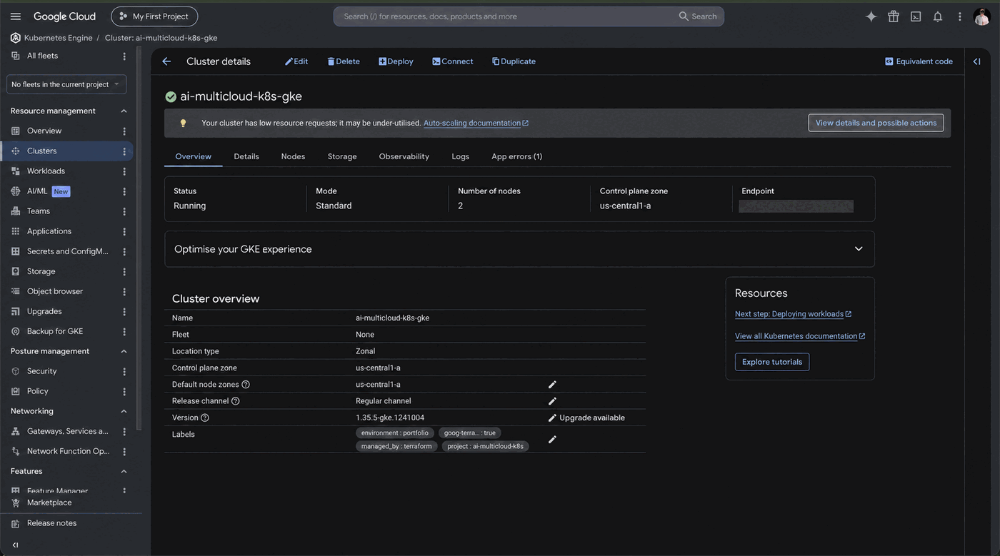

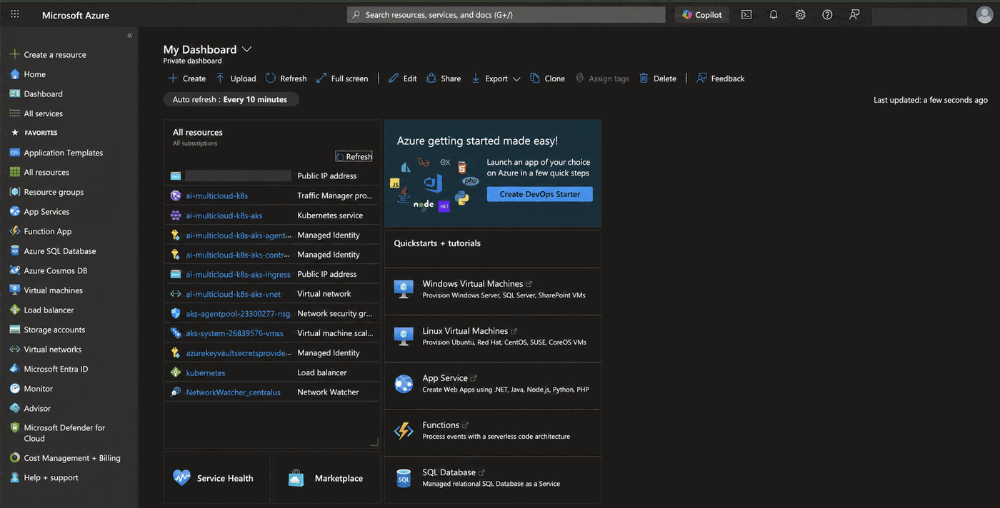

### Healthy GitOps baseline

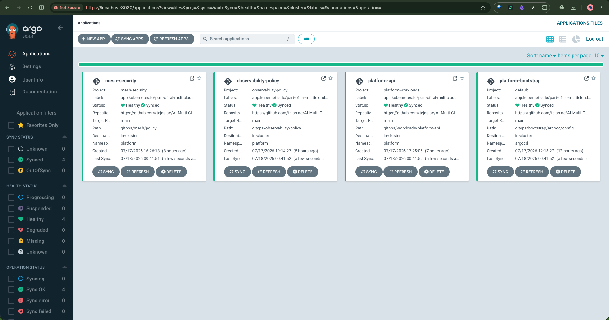

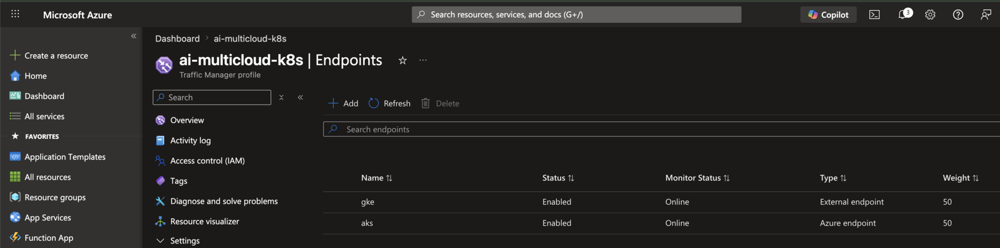

### Controlled GKE availability failure

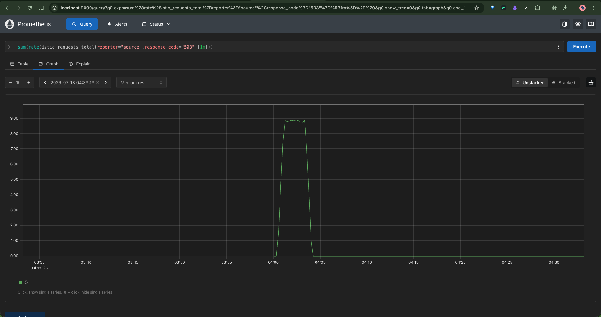

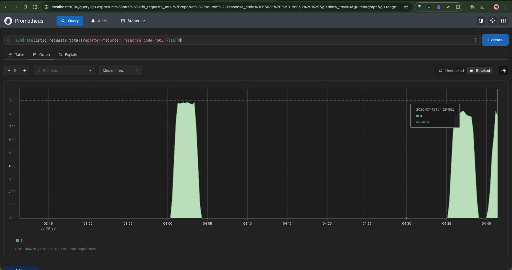

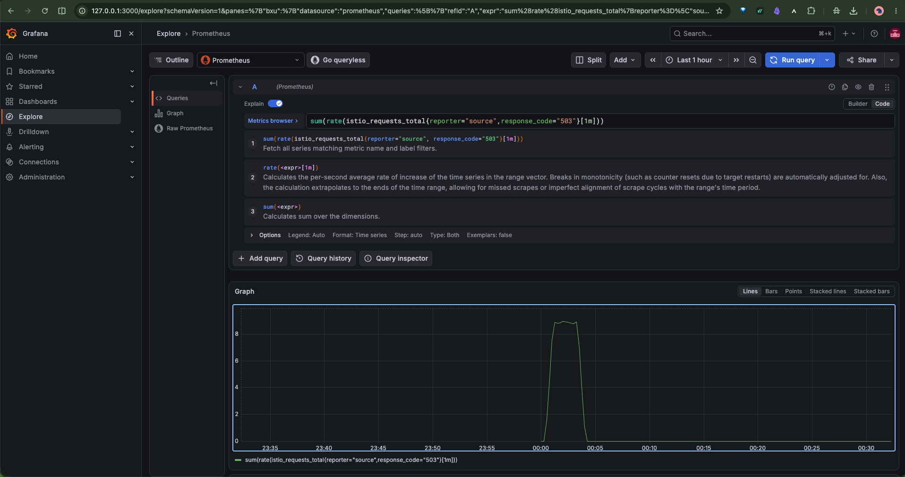

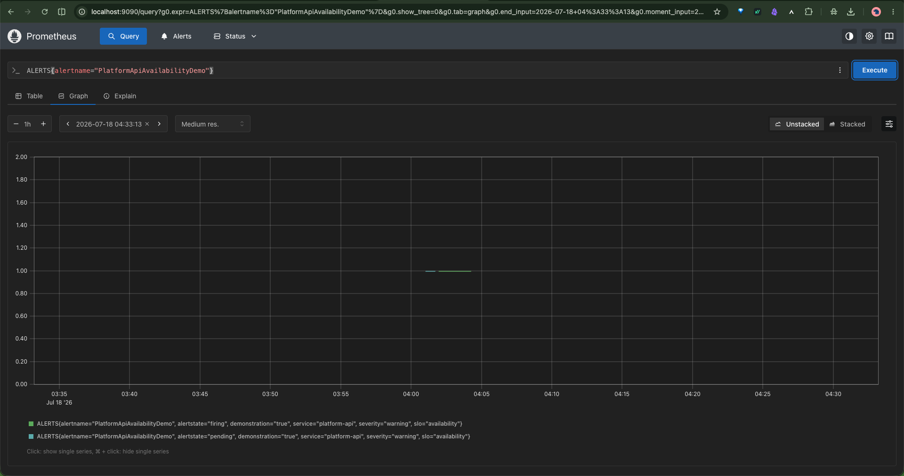

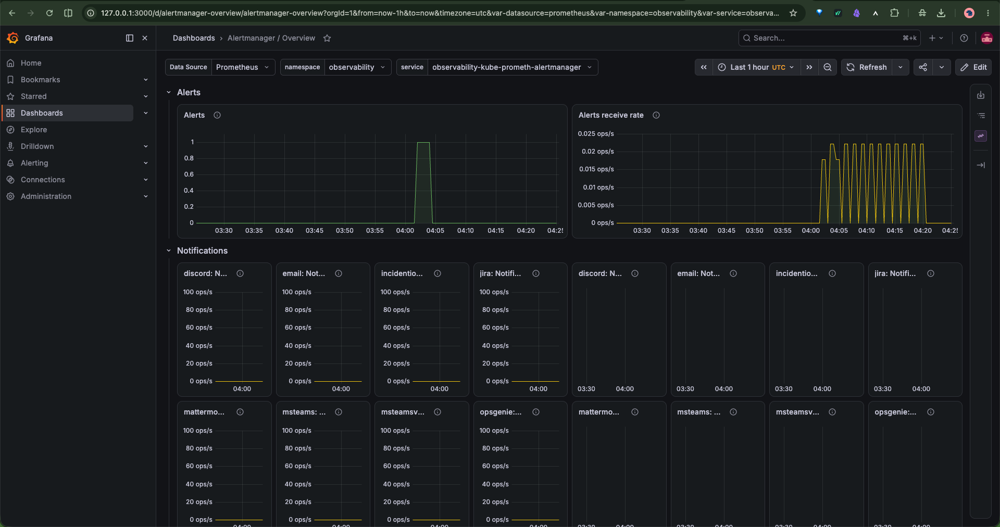

### Evidence-grounded Claude recommendation

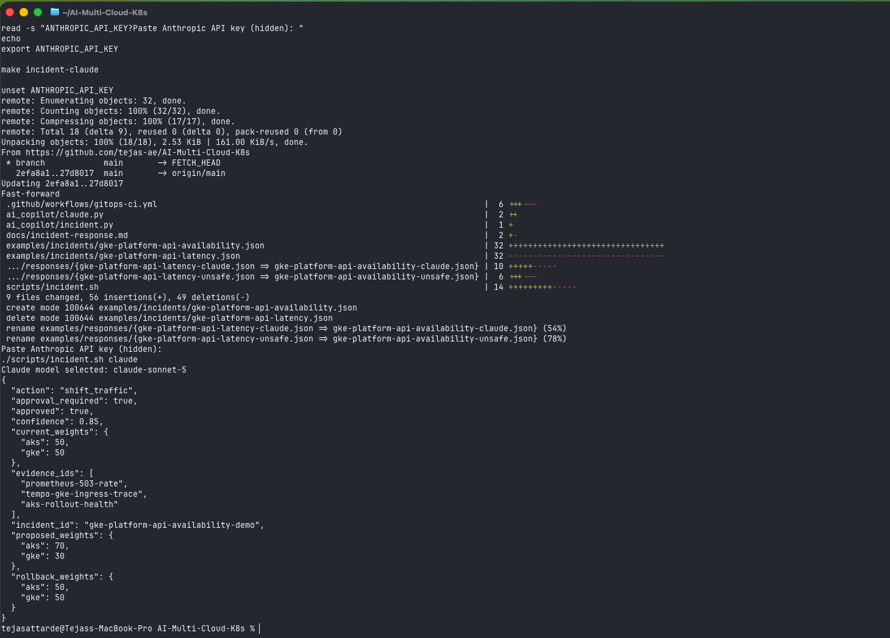

### Deterministic safety rejection

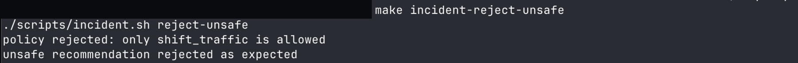

### Human-approved traffic shift and recovery

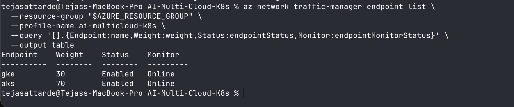

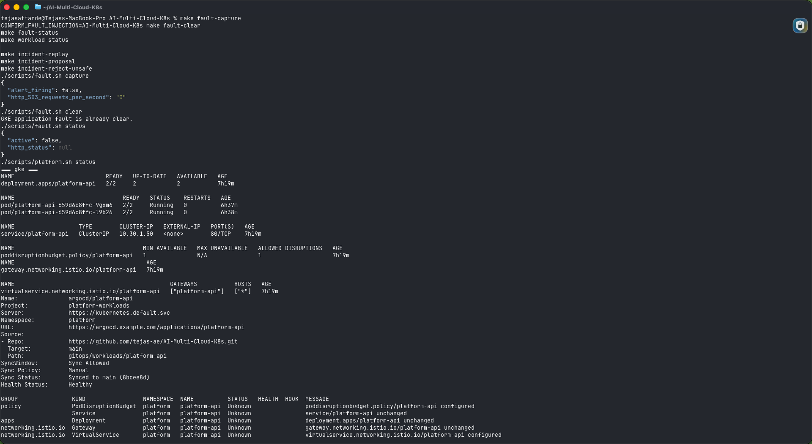

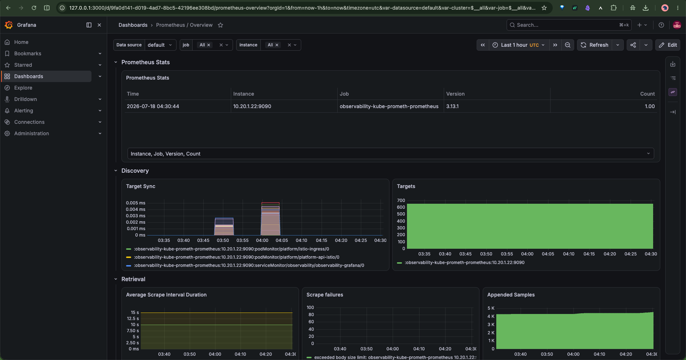

</details>

## Repository guide

- [End-to-end incident walkthrough](docs/incident-walkthrough.md)
- [Portfolio demonstration runbook](docs/demo-runbook.md)
- [Controlled fault design](docs/fault-injection.md)
- [Incident-response guardrails](docs/incident-response.md)
- [Live Claude analyzer](docs/claude-analyzer.md)
- [SLO and Alertmanager design](docs/slo-alerting.md)
- [Observability implementation](docs/observability.md)
- [GitOps design](docs/gitops.md)

## Scope

This is deliberately bounded. The cloud foundation, delivery layer, workload, observability stack, controlled incident, live Claude analysis, human-approved traffic shift, recovery verification, Git rollback, and visual evidence set have all been exercised and published. The remaining portfolio work is publishing actual cost measurements, followed by mandatory destruction and verification of every billable resource.
